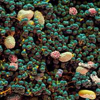
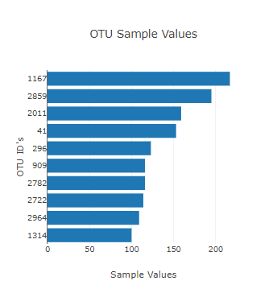
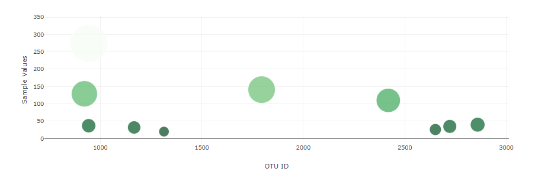
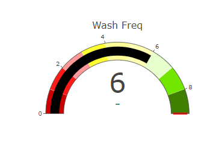

# Interactive Dashboards With Plot.ly - Belly Button Biodiversity

For this assignment, I built an interacitive dashboard to explore the Belly Button Biodiversity dataset, which catalogs the microbes that colonize human navels.

The dataset reveals that a small handful of microbial species (also called operational taxonomic units, or OTUs, in the study) were present in more than 70% of people, while the rest were relatively rare.

## Import dataset

Utilizing D3 (Data-Driven Documents), to read the data file in JSON format the data was extracted into an array of objects.

    d3.json("../../samples.json").then((data) => {
        names = data.names.map(d => d);
        demographics = data.metadata;
        samples = data.samples;
        names.forEach(function(element){
            optionitem = selector.append("option");
            optionitem.text(element);
        })    
        });

The **demographics** array contains the entire dataset that will be utilized to populate chart data.

## Manipulate the DOM Using D3 and Plot.ly to Refresh Subject Related Chart By Subject Id Drop Down Filter
A function was created with **Id** parameter which populates  local variables and arrays with subject data that will populate dashboard charts.  The function is called with the onchange event that is triggered when a new drop down option is selected.   (Actual screenshots):

#### Bar Chart
The following is a bar chart with the top 10 OTU's by sample count in descending order. 

#### Scatter Chart
The following scatter/bubble chart consists of OTU Id in X axis and Sample Values in Y axis. Marker (bubble) size correlates to actual Sample Value.  A formula is used to ensure the bubble size are visually appealing, as well as pre defined column scheme "Greens".

**Chart Code:**

    var desired_maximum_marker_size = 80;
    var trace = {
        y: sample_values_int.slice(0,10).reverse(),
        x: otu_ids[0].slice(0,10).reverse(),
        text: otu_labels[0].slice(0,10).reverse(),
        type: "scatter",
        mode: "markers",
        marker: {
            size: sample_values_int.slice(0,10).reverse(),
            sizeref: 2.0 * Math.max(...sample_values_int.slice(0,10).reverse()) / (desired_maximum_marker_size**2),
            sizemode: 'area',
            colorscale: "Greens",
            color: sample_values_int.slice(0,10).reverse()
        }
        };
    
    data = [trace];

    var layout = {
    xaxis: { title: "OTU ID" },
    yaxis: { title: "Sample Values"}
    };

    Plotly.react("bubble", data,layout);

#### Indicator Gauge
The indicator gauge is for the bonus. I had some issues with the formatting, but I was able to turn it into a red, yellow and green gauge, with the chart progressing from red to green as wash frequency increases. The wash frquency text shows on the chart as well.

Feel free to test out the visualization.
[Dashboard Site](https://mregpala.github.io/interactive-dashboard/)